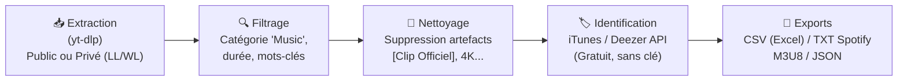

# 🎵 YT-Playlist-Fetcher

> **Extracteur intelligent de playlists YouTube avec filtrage musical, nettoyage des titres et identification automatique des morceaux (iTunes & Deezer).**

[](https://www.python.org/)
[](https://github.com/yt-dlp/yt-dlp)
[](https://opensource.org/licenses/MIT)

---

## 🌟 Points Forts

- 🚀 **Extraction 100% complète :** Récupère toutes les vidéos d'une playlist (même de plusieurs milliers d'éléments) sans limitation de défilement web.
- 🔒 **Support des playlists privées :** Récupère vos **Vidéos « J'aime » (`LL`)** et **« À regarder plus tard » (`WL`)** grâce à la gestion sécurisée des sessions de navigation (Chrome, Edge, Firefox, Brave) ou fichier `cookies.txt`.
- 🧹 **Nettoyage intelligent des titres :** Élimine automatiquement les artefacts de clips (`[Clip Officiel]`, `(Official Video)`, `4K`, `[Lyrics]`, `(Audio HD)`, etc.).
- 🎯 **Filtrage Musical :** Isole la musique des autres contenus (tutoriels, podcasts, vlogs, gameplays, critiques).
- 🏷️ **Identification & Métadonnées :** Interroge gratuitement les bases iTunes & Deezer (sans clé API) pour obtenir le nom d'artiste officiel, le vrai titre, l'album, le genre et l'année de sortie.
- 💾 **Multi-exports :** Génère du **CSV (Excel)**, du **TXT pour import direct Spotify/Deezer**, du **M3U8** pour VLC et du **JSON**.

---

## 🏗️ Architecture



---

## 📦 Installation

1. **Cloner le dépôt :**
   ```bash
   git clone https://github.com/silveremartin-dev/YT-Playlist-Fetcher.git
   cd YT-Playlist-Fetcher
   ```

2. **Créer l'environnement virtuel et installer les dépendances :**
   ```bash
   python -m venv .venv
   .\.venv\Scripts\activate
   pip install -r requirements.txt
   ```

---

## 🚀 Utilisation

### 1. Mode Rapide (Double-clic sous Windows)
Double-cliquez simplement sur le fichier **`launch.bat`**.

### 2. Mode Interactif (Console)
```bash
python main.py
```
Un menu interactif vous guide pas à pas pour choisir la playlist, le navigateur pour les cookies, et activer ou non l'enrichissement iTunes.

### 3. Mode Ligne de Commande (CLI)
```bash
# Extraire vos Vidéos "J'aime" (Liked Videos) avec session Chrome
python main.py --url "https://www.youtube.com/playlist?list=LL" --browser chrome

# Extraire "À regarder plus tard" (Watch Later)
python main.py --url "https://www.youtube.com/playlist?list=WL" --browser chrome

# Extraire une playlist publique quelconque
python main.py --url "https://www.youtube.com/playlist?list=PLxxxxxxxxxxxxxxxx"

# Utiliser un fichier cookies.txt exporté
python main.py --url "https://www.youtube.com/playlist?list=LL" --cookies cookies.txt
```

---

## 📁 Formats des fichiers exportés (dans `exports/`)

| Fichier | Format | Description / Utilisation |
|---|---|---|
| `*_musique.csv` | CSV (UTF-8 avec BOM) | Tableau complet compatible **Excel** avec Artiste, Titre, Album, Genre, Année, Durée et URL. |
| `*_spotify_import.txt` | Texte brut (`Artiste - Titre`) | Prêt pour l'import en 1 clic dans **Spotify / Deezer / Apple Music** via [Spotlistr](https://www.spotlistr.com/) ou [TuneMyMusic](https://www.tunemymusic.com/). |
| `*.m3u8` | Playlist multimédia | Ouvrable directement dans **VLC**, **foobar2000**, etc. |
| `*_musique.json` | JSON structuré | Données brutes et métadonnées pour intégration dans d'autres applications. |
| `*_non_musique.csv` | CSV | Liste des vidéos écartées par le filtre (podcasts, tutos, etc.) pour ne rien perdre. |

---

## 📄 Licence

Projet distribué sous licence MIT.
