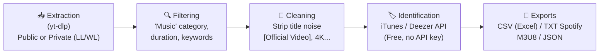

# 🎵 YT-Playlist-Fetcher

> **Smart YouTube playlist extractor with music filtering, title cleaning, and automatic track identification (iTunes & Deezer).**

[](https://www.python.org/)
[](https://github.com/yt-dlp/yt-dlp)
[](https://opensource.org/licenses/MIT)

---

## 🌟 Highlights

- 🚀 **100% Full Extraction:** Fetches all videos from a playlist (even with thousands of items) without browser scrolling limits.
- 🔒 **Private Playlists Support:** Easily retrieve your **"Liked Videos" (`LL`)** and **"Watch Later" (`WL`)** playlists using local browser sessions (Chrome, Edge, Firefox, Brave, Opera, Vivaldi) or a `cookies.txt` file.
- 🧹 **Smart Title Cleaning:** Automatically strips video noise and artifacts (`[Official Video]`, `[Clip Officiel]`, `4K`, `[Lyrics]`, `(Audio HD)`, etc.).
- 🎯 **Music Filtering:** Isolates music tracks from non-musical content (tutorials, podcasts, vlogs, gameplay, reviews).
- 🏷️ **Track Identification & Metadata Enrichment:** Queries free iTunes & Deezer databases (no API key required) to identify official artist names, track titles, albums, genres, and release years.
- 💾 **Multi-Format Export:** Generates **Excel-compatible CSV**, **Spotify/Deezer 1-click import TXT**, **M3U8** playlist files for media players (VLC, foobar2000), and structured **JSON**.

---

## 🏗️ Architecture



---

## 📦 Installation

1. **Clone the repository:**
   ```bash
   git clone https://github.com/silveremartin-dev/YT-Playlist-Fetcher.git
   cd YT-Playlist-Fetcher
   ```

2. **Create a virtual environment and install dependencies:**
   ```bash
   python -m venv .venv
   
   # On Windows:
   .\.venv\Scripts\activate
   
   # On Linux / macOS:
   source .venv/bin/activate

   pip install -r requirements.txt
   ```

---

## 🚀 Usage

### 1. Quick Launch (Windows Double-Click)
Simply double-click the **`launch.bat`** file.

### 2. Interactive Mode (Terminal)
```bash
python main.py
```
An interactive terminal menu will guide you step by step to select the playlist, choose the browser for cookies (if private), and toggle iTunes/Deezer track identification.

### 3. Command Line Interface (CLI)
```bash
# Extract your "Liked Videos" using Chrome session cookies
python main.py --url "https://www.youtube.com/playlist?list=LL" --browser chrome

# Extract "Watch Later" playlist using Edge session cookies
python main.py --url "https://www.youtube.com/playlist?list=WL" --browser edge

# Extract any public or unlisted playlist
python main.py --url "https://www.youtube.com/playlist?list=PLxxxxxxxxxxxxxxxx"

# Use an exported cookies.txt file
python main.py --url "https://www.youtube.com/playlist?list=LL" --cookies cookies.txt
```

#### CLI Options
- `--url`, `-u`: YouTube playlist URL (supports `LL`, `WL`, and standard playlist URLs).
- `--browser`, `-b`: Browser name to extract session cookies from (`chrome`, `edge`, `firefox`, `brave`, `opera`, `vivaldi`).
- `--cookies`, `-c`: Path to a `cookies.txt` file (auto-detected if placed in the project folder).
- `--all`: Keep all videos without filtering for music.
- `--no-enrich`: Skip iTunes / Deezer metadata enrichment.
- `--output`, `-o`: Custom output directory (default: `exports`).

---

## 📁 Export Formats (saved in `exports/`)

| File | Format | Description / Use Case |
|---|---|---|
| `*_music.csv` | CSV (UTF-8 with BOM) | Full table compatible with **Excel** / **Google Sheets** containing Artist, Title, Album, Genre, Year, Duration, and URLs. |
| `*_spotify_import.txt` | Plain text (`Artist - Title`) | Ready for 1-click import into **Spotify**, **Deezer**, or **Apple Music** via [Spotlistr](https://www.spotlistr.com/) or [TuneMyMusic](https://www.tunemymusic.com/). |
| `*.m3u8` | Multimedia Playlist | Playable directly in **VLC**, **foobar2000**, and other media players. |
| `*_music.json` | Structured JSON | Raw and enriched metadata for programmatic usage or third-party tools. |
| `*_non_music.csv` | CSV | List of non-music videos filtered out (podcasts, tutorials, etc.) so no item is lost. |

---

## 🔒 Security & Privacy

- **Cookies are strictly local:** Session cookies or `cookies.txt` are only read locally by `yt-dlp` to authenticate requests with YouTube. No credentials or session tokens are ever sent to external third parties.
- **Git protection:** All cookie files (`*cookie*`, `*.cookies`, `cookies/`), environment files, and export files (`exports/`, `*.csv`, `*.json`, `*.m3u8`) are systematically ignored via `.gitignore` to prevent any accidental commit to public repositories.

---

## 📄 License

Distributed under the [MIT License](LICENSE).
